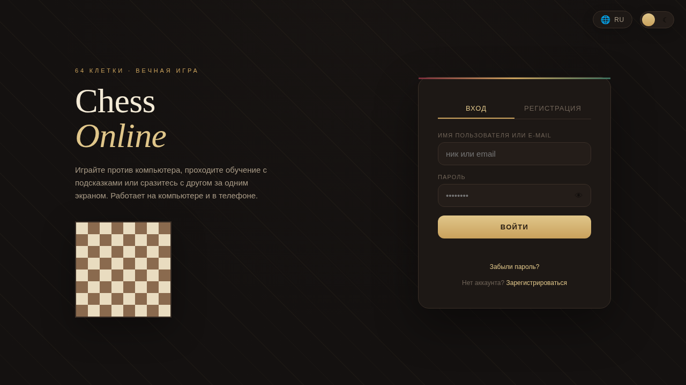

# Chess Online

*[Русская версия](README.ru.md)*

A browser chess game written in vanilla JavaScript — no frameworks, no backend.
Play against the computer, play locally with a friend on one screen, or enter the
ranked lobby. Includes a progression system and a cosmetics shop. Works on desktop
and mobile.

**Live demo:** https://dmorozovs.github.io/Chess-Online/



---

## Features

### Chess engine
Complete rules, implemented from scratch:

- move generation for every piece, including sliding pieces (queen, rook, bishop);
- castling on both sides, with checks that the king is not in check and does not
  pass through an attacked square;
- en passant capture;
- pawn promotion;
- check, checkmate and stalemate detection;
- filtering out moves that would leave your own king in check.

### Computer opponent
Minimax with alpha-beta pruning and positional board evaluation.
Three difficulty levels are set by search depth. The same function powers the
in-game hint that suggests the best move to the player.

### Interface and state
- board rendering with highlights for the selected piece, legal moves and check;
- game clock with time control and loss-on-time handling;
- move log and captured-piece tray;
- dark and light themes;
- localization (English / Russian) via a dictionary and a `t(key)` lookup;
- responsive layout built on CSS Grid and custom properties, with touch support.

### Accounts and progression
- registration, login and account recovery;
- passwords are never stored in plain text — they are hashed with `crypto.subtle`
  (SHA-256) and a per-user salt;
- storage sits behind a `Store` abstraction, so localStorage can be swapped for a
  real backend without rewriting the rest of the code;
- statistics, ranks, XP, achievements, match history, daily tasks, in-game currency
  and a shop for board and piece skins.

---

## Tech stack

HTML, CSS, JavaScript (ES6+). No libraries, no build step, no dependencies.

## Project structure

```
index.html   — markup for all screens
style.css    — styles, themes, responsive layout
script.js    — engine, AI, state, rendering, storage
```

## Running locally

```bash
git clone https://github.com/DMorozovs/Chess-Online.git
cd Chess-Online
python3 -m http.server 8000
```

Then open http://localhost:8000

Opening `index.html` directly also works, but a local server is more reliable —
some browser APIs are unavailable over the `file://` protocol.

## Roadmap

- [ ] real multiplayer over WebSocket instead of a simulated lobby
- [ ] PGN export
- [ ] move takeback and game review
